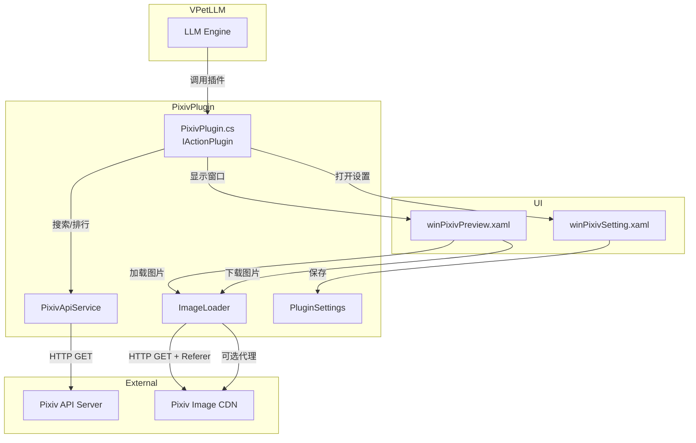

# Design Document

## Overview

Pixiv 插件是 VPetLLM 的一个功能扩展，允许用户通过 LLM 对话搜索 Pixiv 图片或获取随机推荐图片。插件调用第三方 Pixiv API 获取数据，并在 WPF 窗口中展示图片预览，支持图片导航、下载和元数据显示。

核心特性：
- 关键词搜索 Pixiv 图片
- 从日榜随机推荐图片
- 图片预览窗口（支持导航、下载）
- 防盗链处理（Referer Header）
- 可选代理设置（仅用于图片加载）

## Architecture



## Components and Interfaces

### 1. PixivPlugin (主插件类)

实现 `IActionPlugin` 和 `IPluginWithData` 接口。

```csharp
public class PixivPlugin : IActionPlugin, IPluginWithData
{
    // IActionPlugin 接口
    string Name { get; }           // "Pixiv"
    string Author { get; }         // "ycxom"
    string Description { get; }    // 多语言描述
    string Parameters { get; }     // "action(search/random), keyword(string)"
    string Examples { get; }       // 使用示例
    bool Enabled { get; set; }
    string FilePath { get; set; }
    
    // IPluginWithData 接口
    string PluginDataDir { get; set; }
    
    void Initialize(VPetLLM plugin);
    Task<string> Function(string arguments);
    void Unload();
}
```

### 2. PixivApiService (API 服务)

负责与 Pixiv API 通信。

```csharp
public class PixivApiService
{
    private const string BaseUrl = "https://ai.ycxom.top:6523/api";
    private const string ApiKey = "pk_8a73dbf63a8d7c1535946e69d6b789fd";
    
    Task<PixivSearchResponse?> SearchAsync(string keyword);
    Task<PixivRankingResponse?> GetRankingAsync(string mode = "day");
}
```

### 3. ImageLoader (图片加载器)

处理图片加载和防盗链。

```csharp
public class ImageLoader
{
    private const string PixivReferer = "https://www.pixiv.net/";
    
    Task<BitmapImage?> LoadImageAsync(string url);
    Task<bool> DownloadImageAsync(string url, string savePath, IProgress<int>? progress);
    void SetProxy(string? proxyUrl);
}
```

### 4. PluginSettings (设置管理)

```csharp
public class PluginSettings
{
    public bool UseProxy { get; set; }
    public bool FollowVPetLLMProxy { get; set; }
    public string? ProxyUrl { get; set; }
}
```

### 5. winPixivPreview (预览窗口)

WPF 窗口，显示图片预览和控制。

主要控件：
- Image: 显示缩略图
- TextBlock: 标题、作者、标签
- Button: 上一张、下一张、下载
- ProgressBar: 下载进度
- TextBlock: 页码指示器

### 6. winPixivSetting (设置窗口)

WPF 窗口，配置代理设置。

主要控件：
- CheckBox: 启用代理
- CheckBox: 跟随 VPetLLM 代理
- TextBox: 代理地址

## Data Models

### PixivIllust (插画数据)

```csharp
public class PixivIllust
{
    public long Id { get; set; }
    public string Title { get; set; }
    public string Caption { get; set; }
    public PixivUser User { get; set; }
    public PixivImageUrls ImageUrls { get; set; }
    public PixivMetaSinglePage MetaSinglePage { get; set; }
    public List<PixivMetaPage> MetaPages { get; set; }
    public int PageCount { get; set; }
    public int Width { get; set; }
    public int Height { get; set; }
    public List<PixivTag> Tags { get; set; }
    public int TotalBookmarks { get; set; }
    public int TotalView { get; set; }
    public DateTime CreateDate { get; set; }
}

public class PixivUser
{
    public long Id { get; set; }
    public string Name { get; set; }
    public string Account { get; set; }
}

public class PixivImageUrls
{
    public string Large { get; set; }      // 缩略图 URL
    public string Medium { get; set; }
    public string SquareMedium { get; set; }
}

public class PixivMetaSinglePage
{
    public string? OriginalImageUrl { get; set; }  // 单页原图 URL
}

public class PixivMetaPage
{
    public PixivMetaPageUrls ImageUrls { get; set; }
}

public class PixivMetaPageUrls
{
    public string Large { get; set; }
    public string Original { get; set; }   // 多页原图 URL
}

public class PixivTag
{
    public string Name { get; set; }
    public string? TranslatedName { get; set; }
}
```

### PixivSearchResponse / PixivRankingResponse

```csharp
public class PixivSearchResponse
{
    public List<PixivIllust> Illusts { get; set; }
}

// 排行榜响应结构相同
public class PixivRankingResponse
{
    public List<PixivIllust> Illusts { get; set; }
}
```


## Correctness Properties

*A property is a characteristic or behavior that should hold true across all valid executions of a system-essentially, a formal statement about what the system should do. Properties serve as the bridge between human-readable specifications and machine-verifiable correctness guarantees.*

### Property 1: JSON Response Round-Trip Consistency

*For any* valid PixivIllust object, serializing to JSON and then deserializing should produce an equivalent object with all fields preserved.

**Validates: Requirements 1.2**

### Property 2: Empty/Whitespace Keyword Rejection

*For any* string composed entirely of whitespace characters (including empty string), the search function should reject it and return an error without making an API request.

**Validates: Requirements 1.4**

### Property 3: Random Selection Membership

*For any* non-empty list of Illust objects, the randomly selected item should be a member of the original list.

**Validates: Requirements 2.2**

### Property 4: Navigation Index Bounds

*For any* list of images and current index, after clicking next the index should be min(currentIndex + 1, listLength - 1), and after clicking previous the index should be max(currentIndex - 1, 0).

**Validates: Requirements 3.2, 3.3**

### Property 5: Original Image URL Resolution

*For any* PixivIllust object and page index:
- If page_count == 1, the original URL should be meta_single_page.original_image_url
- If page_count > 1, the original URL should be meta_pages[pageIndex].image_urls.original

**Validates: Requirements 4.1, 8.1, 8.3**

### Property 6: Settings Persistence Round-Trip

*For any* valid PluginSettings object, saving to file and then loading should produce an equivalent settings object.

**Validates: Requirements 6.4**

## Error Handling

### API Errors
- Network timeout: 显示 "网络请求超时，请稍后重试"
- API 返回错误: 显示 "API 请求失败: {error_message}"
- 空结果: 显示 "未找到相关图片"

### Image Loading Errors
- 图片加载失败: 显示占位图，提示 "图片加载失败"
- 防盗链错误 (403): 自动重试带 Referer 头
- 代理连接失败: 提示检查代理设置

### Download Errors
- 下载失败: 显示错误信息，提供重试按钮
- 磁盘空间不足: 提示用户清理空间
- 文件写入失败: 提示检查权限

## Testing Strategy

### Unit Testing

使用 xUnit 进行单元测试：

1. **PixivApiService Tests**
   - 测试 URL 构建是否正确
   - 测试空关键词验证

2. **ImageLoader Tests**
   - 测试 Referer 头是否正确设置
   - 测试代理配置是否生效

3. **Navigation Logic Tests**
   - 测试边界条件（首张/末张图片）

### Property-Based Testing

使用 **FsCheck** (.NET 的属性测试库) 进行属性测试：

配置：每个属性测试运行最少 100 次迭代。

测试标注格式：`**Feature: pixiv-plugin, Property {number}: {property_text}**`

1. **JSON Round-Trip Property**
   - 生成随机 PixivIllust 对象
   - 序列化后反序列化
   - 验证等价性

2. **Whitespace Rejection Property**
   - 生成随机空白字符串
   - 验证搜索函数拒绝

3. **Random Selection Property**
   - 生成随机非空列表
   - 验证选择结果在列表中

4. **Navigation Property**
   - 生成随机列表长度和当前索引
   - 验证导航后索引正确

5. **URL Resolution Property**
   - 生成随机 PixivIllust（单页/多页）
   - 验证 URL 选择正确

6. **Settings Round-Trip Property**
   - 生成随机设置对象
   - 保存后加载验证等价
